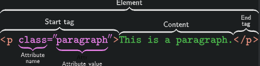
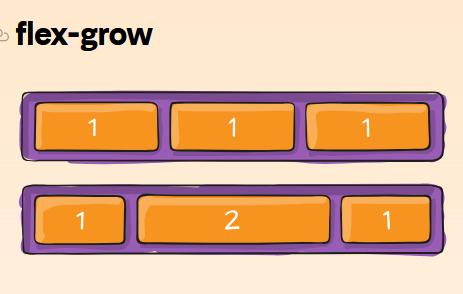
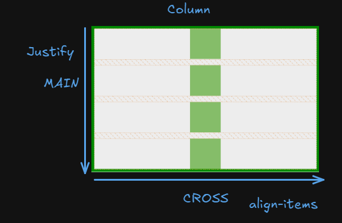

# How does the web work? Extremly simplified version

1. **Translation:** Turning a URL into an IP address.
2. **Request:** Sending a request to the server.
3. **Processing:** The server preparing the content. If the content changes we are dealing with a **dynamic website**, ex: Facebook feed, otherwise it a **static website**, ex: a blog.
4. **Response:** Sending the content back to the browser.
5. **Display:** The browser interpreting and displaying the content.

# URL format `https://www.example.com`

- **Protocol:** Specifies the method used to access the resource (e.g., `http`, `https`, `ftp`).
- **Domain:** The address of the server hosting the resource (e.g., `www.example.com`).
- **Path:** The specific location of the resource within the server (e.g., `/index.html`).
- **Query:** Optional parameters added to the URL to filter or customize the request (e.g., `?page=2&sort=asc`).


# HTML Basics

- **HTML** (HyperText Markup Language) is the foundation of web pages. It uses tags to structure and present content.

## Tags

- Tags are enclosed in angle brackets `<>`. They come in pairs: an opening tag `<tag_name>` and a closing tag `</tag_name>`.

- A self-closing tag in HTML is a kind of HTML tag that does not need to be closed manually by its closing tag, which means it does not have a separate closing tag as </tag>. Some few self-closing tags are <input/>, <hr/>, <br/>, , etc.

## Attributes

- Attributes provide additional information about a tag. They are placed inside the opening tag and consist of a name and a value, separated by an equal sign.

`<a href="https://www.example.com">Link to Example</a>`



## Common HTML Tags:

- **Heading tags:** `<h1>`, `<h2>`, `<h3>`, `<h4>`, `<h5>`, `<h6>`
- **Paragraph:** `<p>`
- **Line break:** `<br>`
- **Horizontal rule:** `<hr>`
- **Image:** ``
- **Link:** `<a>`
- **List:**
  - Unordered: `<ul>`
  - Ordered: `<ol>`
  - List item: `<li>`
- **Table:**
  - Table: `<table>`
  - Table row: `<tr>`
  - Table header: `<th>`
  - Table data: `<td>`
- **Divisions and spans:**
  - Division: `<div>`
  - Span: `<span>`

## Semantic HTML Tags:

- **Header:** `<header>`
- **Navigation:** `<nav>`
- **Main content:** `<main>`
- **Article:** `<article>`
- **Section:** `<section>`
- **Aside:** `<aside>`
- **Footer:** `<footer>`


## HTML Structure


## Block vs in-line element

### Block level

- Occupy their own line on the page.
- Examples:
  - `<p>` (paragraph)
  - `<h1>` to <h6> (headings)
  - `<div>` (division)
  - `<ul>` (unordered list)
  - `<ol>` (ordered list)
  - `<li>` (list item)
  - `<header>` (header)

### In-line level

- Do not start on a new line.
- Examples:
  - `<span>` (spans a section of text)
  - `<a>` (anchor/link)
  - `<strong>` (strong emphasis)
  - `<em>` (emphasis)
  - `<b>` (bold)


## Best Practices:

- Semantic HTML: Use tags that accurately describe the content.
- CSS: Style your HTML with CSS.
- JavaScript: Add interactivity with JavaScript.
- Validate HTML: Ensure correct structure. `https://validator.w3.org/`

# CSS Basics and Fundamentals

## **CSS Basics**

### What is CSS?

CSS (Cascading Style Sheets) is a stylesheet language used to control the presentation of HTML elements on a webpage. It separates content (HTML) from design (CSS), enabling you to style your webpages consistently and efficiently.

### How CSS Works with HTML

CSS works by selecting HTML elements and applying styles to them. This is achieved by linking CSS rules to HTML elements through **selectors**. CSS can be included in three ways:

1. **Inline CSS**: Applied directly to HTML elements using the `style` attribute.

- Relative path (Always use this one):
  - `./` current location
  - `../` backward location
  - `../folder1/style.css`

2. **Internal CSS**: Defined within a `<style>` tag in the `<head>` section of an HTML document.
3. **External CSS**: Written in an external file with a `.css` extension and linked using the `<link>` tag in the HTML file.

### CSS Syntax and Structure

CSS rules consist of:

- **Selectors**: Target the HTML elements you want to style.
- **Properties**: Define what aspect of the element you want to style.
- **Values**: Specify the desired style for the property.

1. Create HTML file accordingly

2. Link a CSS file to a HTML

- h1 - culoare text verde; background rosu
- h2 - text-ul de 58 px
- div - background color: portocaliu, inaltime 35 px
- p - border cu grosime de 7 pixeli si culoare mov
- span care contine "Hello World" cu background roz si latime 150px
- anchor tag care contine "Hello Web" cu background rosu si inaltime 150px si te duce pe google

- Example:

```css
h1 {
  color: blue; /* Selector: h1, Property: color, Value: blue */
  font-size: 24px;
}
```

## Basic Selectors

### Tag Selector

Targets all elements of a specific tag.

```css
p {
  color: red;
}
```

### Class Selector

Targets elements with a specific class name (prefixed with .).

.highlight {
background-color: yellow;
}

### ID Selector

#header {
font-size: 20px;
}

1. Selectati P-ul din interiorul unui DIV si faceti background-ul albastru
2. Selectati Span-urile care au clasa my-span si faceti textul-underline
3. Selectati elementele care au clasa class1 si class2 si faceti font-ul uppercase


## Common CSS Properties

- `color`: Sets the text color.
- `font-size`: Adjusts the size of the text.
- `background`-color: Changes the background color of an element.
- `margin`: Creates space around an element.
- `padding`: Creates space inside an element, between content and the border.
- `border`: Defines the outline of an element.

## CSS Box Model

The box model explains how the size and spacing of an element are calculated. It consists of:

- **Content**: The actual content of the element (e.g., text, images).
- **Padding**: Space between the content and the border.
- **Border**: A line surrounding the padding (if any).
- **Margin**: Space between the element's border and neighboring elements.


## Units in CSS

CSS uses various units to define measurements like width, height, font size, etc. These units are categorized into:
Absolute Units

- px (pixels): Fixed-size units, commonly used for precise measurements.
- cm, mm, in: Rarely used physical units for specific printing purposes.

### Relative Units

- `%:` Percentage relative to the parent element's size.
- `em`: Relative to the font size of the parent element.
- `rem`: Relative to the root element's font size.
- `vh` (viewport height): x% of the viewport's height.
- `vw` (viewport width): x% of the viewport's width.

## Table HTML

- `<table>`: Wrapper of the body
- `<thead>`: Table header rows
- `<tbody>`: Table body rows
- `<tfoot>`: Table footer rows
- `<caption>`: Element to provide a brief description.

```html
<table>
  <caption>
    Store products
  </caption>
  <thead>
    <tr>
      <th>Product</th>
      <th>Quantity</th>
      <th>Price</th>
    </tr>
  </thead>
  <tbody>
    <tr>
      <td>Product A</td>
      <td>100</td>
      <td>$9.99</td>
    </tr>
  </tbody>
  <tfoot>
    <tr>
      <td colspan="2">Total</td>
      <td>$1998.00</td>
    </tr>
  </tfoot>
</table>
```

## Positioning and Layout

### Position Property

- static: Default value. Elements are positioned according to the normal document flow.
- relative: Element is positioned relative to its normal position.
- absolute: Element is positioned relative to its nearest positioned ancestor (or the containing block if there is no positioned ancestor).
- fixed: Element is positioned relative to the viewport, and it stays fixed even if the page is scrolled.

```css
.parent {
  position: relative;
  width: 300px;
  height: 200px;
  border: 1px solid black;
}

.child {
  position: absolute;
  top: 50%;
  left: 50%;
  /* transform: translate(-50%, -50%); */
  width: 100px;
  height: 100px;
  background-color: blue;
}
```

### Float

- Float: Takes an element out of the normal document flow and positions it to the left or right of its container.

### Flexbox

- A flexible box layout model that allows elements to be arranged with greater flexibility than traditional layout methods.

#### Main Concepts:

- **Flex Container**: The parent element of flex items.
- **Flex Item**: A child element of a flex container.
- **Flex Properties**:

  - `flex-direction`: Determines the main axis of the flex container (row or column).
    - ❗This also inverses the main and cross axis.
  - `flex-wrap`: Controls whether flex items wrap to a new line.
  - `justify-content`: Aligns flex items along the main axis.
  - 
  - `align-items`: Aligns flex items along the cross axis.
  - 
  - `align-content`: Aligns multiple lines of flex items along the cross axis.
  - 
  - `gap`
  - 

##### Properties on child

- `order`: By default, flex items are laid out in the source order. However, the order property controls the order in which they appear in the flex container.
- 
- `grow`: This defines the ability for a flex item to grow if necessary. It accepts a unitless value that serves as a proportion. It dictates what amount of the available space inside the flex container the item should take up.
  - If all items have flex-grow set to 1, the remaining space in the container will be distributed equally to all children. If one of the children has a value of 2, that child would take up twice as much of the space as either one of the others (or it will try, at least).
- 
- `flex-shrink`: This defines the ability for a flex item to shrink if necessary.
- `align-self`
- 

##### Axis




### Pseudo Classes

- Style elements based on their state or relationship to other elements, rather than just their static properties.

```css
element:pseudo-class {
  color: blue;
  text-decoration: underline;
}
```

####

- **hover**: Applies styles when the mouse hovers over an element.

```css
a:hover {
  color: blue;
  text-decoration: underline;
}
```

- **active**: Applies styles when an element is being actively clicked or pressed.

```css
button:active {
  background-color: darkgray;
}
```

- **focus**: Applies styles when an element receives focus, usually by keyboard navigation or clicking.

```css
button:active {
  background-color: darkgray;
}
```

- **visited**: Applies styles when an element receives focus, usually by keyboard navigation or clicking.

```css
a:visited {
  color: purple;
}
```

- **first-child**: Applies styles when an element receives focus, usually by keyboard navigation or clicking.

```css
p:first-child {
  font-weight: bold;
}
```

- **last-child**: Applies styles to the last child element of its parent.

```css
li:last-child {
  border-bottom: none;
}
```

- **nth-child(n)**: Applies styles to specific child elements based on their position.

```css
li:nth-child(2) {
  background-color: lightgray;
}

li:nth-child(2n) {
  background-color: aqua;
}
```

#### Note

- Link has 4 states:

1. :link
2. :visited
3. :hover
4. :active

- **root** - Selects the element that is at the root of the document. Almost certainly will select the element HTML.

### Variables

- CSS variables, also known as custom properties, are a fantastic way to streamline your CSS and make it more maintainable and customizable. They allow you to define reusable values that can be used throughout your stylesheet.

#### Declare variables

- You declare a variable using the -- prefix followed by the variable name. You can assign any valid CSS value to it.

```css
:root {
  --primary-color: #336699;
  --secondary-color: #f0f0f0;
  --font-size: 16px;
}
```

### Use the variable

- To use a variable, you employ the var() function.

```css
body {
  color: var(--primary-color);
  font-size: var(--font-size);
}
```

### Benefits

- Centralized Control: By defining variables in a central location (like the :root selector), you can easily change the overall theme or style of your website by modifying a few variables.
- Improved Maintainability: When you need to update a color or font size, you only need to change it in one place, rather than searching through your entire stylesheet.

### Exercise


1. Use root to define base variables for the project

- font-family: sans-serif;
- width: 880px;

### Grid

- It allows you to divide a page into rows and columns, and then position elements within those cells.

```css
.grid-container {
  display: grid;
  /* Other grid properties */
}
```

#### Key Grid Properties

- `Grid Template Rows`: Defines the rows of the grid.

```css
.grid-container {
  display: grid;
  /* Other grid properties */
  grid-template-rows: 100px 200px auto;
}
```

- `Grid Template Columns`: Defines the columns of the grid.

```css
grid-template-columns: 1fr 2fr 1fr;
```

- `Grid Gap`: Sets the gap between rows and columns.

```css
grid-gap: 20px;
```

- `Grid Auto Flow`: Determines how grid items are placed in the grid.

```css
grid-auto-flow: row; /* Default */
grid-auto-flow: column;
grid-auto-flow: dense; /* Packs items tightly */
```

#### Childs

- Place items

```css
.item-c {
  grid-column: 2 / span 2;
  grid-row: 2 / 3;
}
```


## Responsive Design

### Why Responsiveness is Important

1. Enhanced User Experience

   - Ensures content is easy to read and interact with, regardless of the device.
   - Adapts to varying screen sizes, from desktops to mobile devices.

2. Accessibility

   - Makes websites usable for a larger audience, including those with disabilities.

3. SEO Benefits

   - Google prioritizes mobile-friendly sites in search results.

4. Future-proofing

   - Ensures websites remain functional as new devices are introduced.

### Concept of Viewport and Media Queries

#### Viewport

- The visible area of a web page on a device.
- Defined using the `<meta>` tag in HTML:

```css
<meta name="viewport" content="width=device-width, initial-scale=1.0">
```

- `width=device-width`: Sets the width of the viewport to the screen width.
- `initial-scale=1.0`: Sets the initial zoom level.

#### Media Queries

- CSS rules that apply styles based on device characteristics like screen width, height, resolution, and orientation.

```css
@media (max-width: 768px) {
  body {
    background-color: lightgray;
  }
}

@media (condition) {
  /* CSS rules */
}
```


#### CSS Media Queries

```css
@media media-type and (condition) {
  /* CSS rules */
}

/* Small screen */
@media screen and (max-width: 600px) {
  body {
    background-color: lightblue;
  }
}

/* Big screen */
@media screen and (min-width: 1024px) {
  body {
    font-size: 18px;
  }
}

/* tablets */
@media (min-width: 481px) and (max-width: 768px) {
  .container {
    flex-direction: row;
    justify-content: center;
  }
}
```

#### Mobile-first Design

1.  Catering to Mobile Users

- Majority of internet traffic comes from mobile devices.

2.  Performance Optimization

- Reduces load time by focusing on essential content first.

3.  Progressive Enhancement

- Adds complexity for larger screens without compromising performance on smaller devices.

# Links

- https://developer.mozilla.org/en-US/
- https://css-tricks.com/snippets/css/a-guide-to-flexbox/
- https://css-tricks.com/snippets/css/complete-guide-grid/
- https://css-tricks.com/a-complete-guide-to-css-media-queries/
- https://validator.w3.org/ **HTML Checker**
- https://coolors.co/contrast-checker/112a46-acc8e5 **Color Contrast Checker**
- https://www.realtimecolors.com/?colors=050315-fbfbfe-2f27ce-dedcff-433bff&fonts=Inter-Inter **Color generator**
- https://htmlcheatsheet.com/
- https://htmlcheatsheet.com/css/
- https://www.frontendmentor.io/
